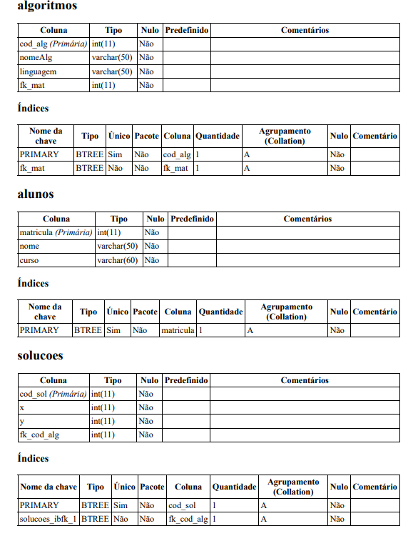

# Sistema de algoritmos e soluções

Sistema fictício onde Alunos podem cadastrar seus algoritmos e as soluções de cada algortimo (X e Y). Sistema possui gráfico de soluções onde é possível compará-las.

Site hospedado no link -> 

#### Dicionário de dados 

